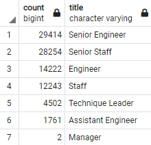

# Pewlett_Hackard_Analysis

## Project Overview
The HR department of Pewlett Hackard has requested an analysis of potential employee retirement rates in the near future. This analysis will consist of:

- Number of employees retiring by title
- List of employees eligible for the Mentorship Program

The purpose of this analysis is to provide insights and recommendations for Pewlett Hackard to prepare for the upcoming retirements with minimal business impact.

## Results

The below chart shows the upcoming retirements by job title.

The below chart contains an excerpt of the provided list of employees eligible for the mentorship program

- A total of 90,398 employees are anticipated to retire in the near future.
- The largest job title group retiring is Senior Engineer with 29,414 (32.54%), followed closly by Senior Staff with 28,254 (31.26%). 
- By job role, Engineer is the largest group retiring with 45,397 (50.22%), followed by Staff with 40,497 (44.80%).
- There are a total of 1,549 employees eligible for the Mentorship Program under the current criteria.

## Summary
